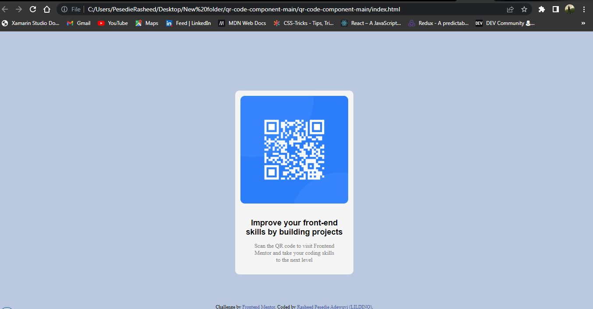

# Frontend Mentor - QR code component solution

This is a solution to the [QR code component challenge on Frontend Mentor](https://www.frontendmentor.io/challenges/qr-code-component-iux_sIO_H). Frontend Mentor challenges help you improve your coding skills by building realistic projects. 

## Table of contents

- [Overview](#overview)
  - [Screenshot](#screenshot)
  - [Links](#links)
- [My process](#my-process)
  - [Built with](#built-with)
- [Author](#author)

## Overview

### Screenshot

Add a screenshot of your solution. The easiest way to do this is to use Firefox to view your project, right-click the page and select "Take a Screenshot". You can choose either a full-height screenshot or a cropped one based on how long the page is. If it's very long, it might be best to crop it.

### Links

- Solution URL: [My solution URL](https://github.com/Adewuyipraise/QRcodechallenge)
- Live Site URL: [Add live site URL here](https://adewuyipraise.github.io/QRcodechallenge/)

## My process

### Built with

- Semantic HTML5 markup
- CSS custom properties

## Author

- Website - [Rasheed Pesedie Adewuyi](https://pesedierasheed.w3spaces.com)
- Frontend Mentor - [@Adewuyipraise](https://www.frontendmentor.io/profile/Adewuyipraise)
- Twitter - [@Rasheedpesedie](https://www.twitter.com/Rasheedpesedie)

